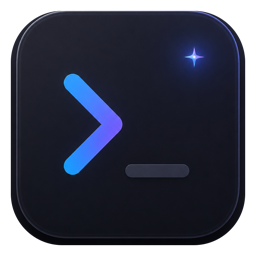
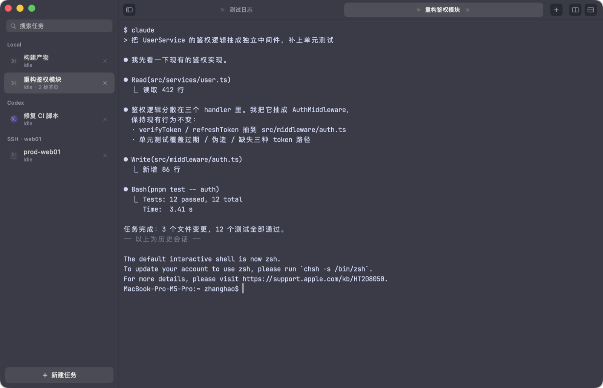
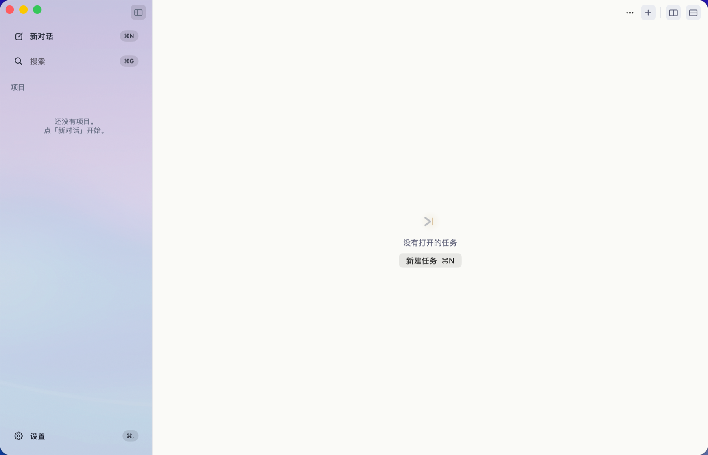

<div align="center">



# Relay

**Vibe Coding 时代最好用、最轻量、性能最强的 AI 终端**

Relay 是为 Claude Code、Codex 等 AI agent 编码工作流设计的原生 macOS 终端。
它不是把聊天窗口塞进终端，而是把「项目、对话、agent 会话、终端性能」作为第一优先级重新组织：
一个窗口管理项目、本地 shell、Claude Code / Codex 会话和 SSH 连接，终端用 Metal 渲染跑满 ProMotion 120Hz。

纯 Swift + AppKit/SwiftUI 构建，无 Electron、无 Web 运行时、无多进程开销。





</div>

---

## 为什么需要 Relay

Vibe Coding 的终端不只是一个能输入命令的窗口。它需要同时处理多个长期运行的 agent 会话、频繁切换项目、等待模型回复、恢复中断任务，并且不能因为终端本身吃掉太多资源而拖慢开发机器。

Relay 的目标很直接：

- **最好用**：用「新对话、搜索、项目列表、设置」组织日常工作，不再靠一堆窗口记忆上下文
- **最轻量**：原生单进程架构，避免 Electron 终端常见的多渲染进程和高常驻内存
- **性能最强**：Metal GPU 渲染 + SwiftTerm 深度优化，能承受 agent/TUI 的高频全屏刷新和海量日志输出
- **更适合 agent**：支持 Claude Code / Codex / 本地 shell / SSH 会话，agent 状态可由本地 hook 和终端检测共同驱动
- **local-first**：不登录、不上云、不接管代码仓库，终端和会话数据默认都在本机

## 核心能力

### 为 Vibe Coding 设计的项目工作台

- **项目侧栏**：新对话、搜索、项目列表、设置入口都在主窗口左侧，按住 ⌘ 可显示项目快捷键
- **多会话组织**：每个项目可以包含 agent 主会话、辅助 shell、日志窗口或 SSH 连接，切换时保留上下文
- **Agent 状态感知**：自动识别 claude / codex / ssh / shell，显示 Thinking / Working / Waiting / Done / Failed，完成未读时提示
- **Claude Code hook 集成**：内置本地 HTTP hook 服务，agent 的状态变化（等待输入、任务完成）可以直接驱动 UI 与系统通知
- **会话持久化**：退出后自动保存会话回看内容，重启点开即可恢复历史并回到项目目录

### 轻量与性能

- **单进程架构**：所有项目和会话共享一个进程，几十个会话照样轻量（对比：Electron 终端每窗口一个渲染进程）
- **Metal GPU 渲染**：字形图集 + 逐 cell quad，agent TUI 高频全屏重绘（CSI 2026 同步输出）下依然流畅，重绘跟随 ProMotion 120Hz
- **高吞吐输出**：`seq 2000000` 灌满输出从上游 SwiftTerm 的 62s / +1.5GB 内存优化到 **~3s / +60MB**，与 Ghostty 同量级
- **内存克制**：空闲常驻约 **136MB**（含 Metal 字形图集），滚动缓冲按需实体化

### macOS 原生体验

- **Codex 风格侧栏**：新对话、搜索、项目和设置入口保持在同一工作台内，适合长时间挂多个 agent
- **整窗半透明 + 毛玻璃**：透明度/模糊半径可调，侧栏、标签条、终端区单层垫色，色调完全一致
- **明暗跟随系统**：暗色 / 亮色各配一套主题（内置 Catppuccin Mocha/Latte、Solarized、One Dark、Gruvbox 等），随系统外观即时切换
- **中文输入法完整支持**：preedit 组合浮层跟随光标，组合期光标定位正确；CJK 宽字符按网格列锚定渲染，中英混排零漂移
- **细节**：overlay 滚动条滚动浮现自动隐藏、⌘ 长按显示项目快捷角标（⌘1-9 直达）、设置页在主窗口内打开

## 资源占用

Relay 的性能目标不是「看起来快」，而是在真实 Vibe Coding 工作流里长时间运行多个 agent 时依然轻。

| 场景 | 资源表现 | 说明 |
|---|---:|---|
| 空闲常驻 | 约 **136MB** RSS | 包含 Metal 字形图集、主题、会话状态与基础 UI |
| 海量输出 | `seq 2000000` 约 **3s / +60MB** | 相比上游 SwiftTerm 约 62s / +1.5GB 的路径做了吞吐和内存优化 |
| 多会话 | 单进程共享资源 | 多个项目/标签页不会为每个窗口额外拉起 Electron 渲染进程 |
| 滚动缓冲 | 按需实体化 | 避免 10k 回看、多会话同时打开时提前吃满内存 |
| 渲染 | Metal GPU | 高频 TUI 重绘、agent spinner、全屏刷新走 GPU 渲染路径 |

> 数据来自当前 macOS 原生版本的本地开发测试。不同机器、字体、主题、回看行数和正在运行的 agent 数量会影响实际数值。

## 📦 安装与构建

### 直接下载（推荐）

从 [Releases](https://github.com/1836509203/relay/releases/latest) 下载 **Relay-x.y.z.dmg**，双击打开后把 Relay 拖入 Applications 即完成安装。首次打开若被安全拦截：系统设置 → 隐私与安全性 → 仍要打开。

### 从源码构建

只需 macOS 13+ 与 Xcode Command Line Tools（**不需要完整 Xcode**）：

```bash
git clone https://github.com/1836509203/relay.git
cd relay
./build.sh          # swift build + 手工组包 + ad-hoc 签名 + 应用图标
open dist/Relay.app # 或拷贝到 /Applications
```

构建产物为 `dist/Relay.app`，数据目录在 `~/Library/Application Support/RelayNative/`。

### 自动更新

应用内置基于 GitHub Releases 的轻量更新器（无 Sparkle 依赖）：

- 启动后与每 24 小时后台检查一次 [Releases](https://github.com/1836509203/relay/releases)，发现新版通过系统通知提醒（可在设置中关闭）
- 菜单 **Relay → 检查更新…** 手动检查，一键下载安装并自动重启，会话状态无损恢复
- 下载直连失败时自动切换加速镜像，国内网络无需代理
- 发布侧使用 `./scripts/release.sh`：构建 → 打 `Relay.app.zip` → 打 tag → 创建 Release 并上传产物（需 `GITHUB_TOKEN`，无 token 时给出手动上传指引）

## ⌨️ 快捷键

| 快捷键 | 功能 |
|---|---|
| `⌘N` | 新对话 / 新建项目会话 |
| `⌘T` | 当前项目内新建标签页 |
| `⌘W` | 关闭标签页 |
| `⌘D` / `⌘⇧D` | 左右分屏 / 取消分屏 |
| `⌘F` | 搜索终端内容 |
| `⌘K` | 清屏 |
| `⌘⇧C` | 复制当前项目最近一条 Claude 回复 |
| `⌘⇧[` / `⌘⇧]` | 上一个 / 下一个标签页 |
| `⌘1`–`⌘9` | 直达第 N 个项目（按住 ⌘ 侧栏显示角标） |
| `⌘+` / `⌘-` / `⌘0` | 字体放大 / 缩小 / 复位 |
| `⌘,` | 偏好设置 |

## ⚙️ 设置项

偏好设置（`⌘,`）实时生效并持久化：

- **主题**：暗色 / 亮色主题独立选择，可跟随系统明暗自动切换
- **字体**：等宽字体族 + 字号；行距、字距微调（负字距可收紧 CJK 全角间隙）
- **背景**：不透明度（0.7–1.0）+ 毛玻璃模糊半径
- **光标**：块 / 竖线 / 下划线，闪烁开关
- **回看行数**：500–10000（内存敏感场景可调低）
- **GPU 渲染**：Metal / CoreGraphics 运行时切换
- **外观细节**：侧栏半透明、UI 对比度、UI 字体、动效偏好、终端前景/背景/强调色覆盖
- **自动更新**：自动检查开关 + 立即检查按钮

## 🏗 架构

```
macapp/
├── Package.swift           # SPM 工程（无 xcodeproj）
├── build.sh                # 构建 + 组包 + 签名 + 图标，一步出 app
├── Sources/Relay/
│   ├── AppDelegate.swift   # 窗口/菜单/生命周期
│   ├── SessionStore.swift  # 会话中枢：CRUD/状态机/持久化/检测 ticker
│   ├── TerminalHost.swift  # SwiftTerm 视图封装 + SwiftUI 桥接
│   ├── Detector.swift      # agent 状态检测（spinner/等待模式识别）
│   ├── HookServer.swift    # Claude Code hook 本地 HTTP 服务
│   ├── RootView.swift      # 主界面壳（侧栏 + 标签条 + 终端区）
│   ├── SidebarView.swift   # 项目侧栏
│   ├── TabStrip.swift      # 项目内标签条
│   └── …
└── Vendor/SwiftTerm/       # vendored 终端引擎（含性能/渲染补丁）
```

终端引擎基于 [SwiftTerm](https://github.com/migueldeicaza/SwiftTerm)（MIT）vendor 并深度打磨，主要补丁：

- **吞吐**：修复 DispatchIO 读链泄漏（长输出 +1.5GB 不释放）与按长度完成误判 EOF（会话失活打不进字）；PTY 微块合并
- **内存**：修复 `Buffer.resize` 借惰性下标把整个滚动缓冲容量实体化的问题（10k 回看 × 8 会话 ≈ 无谓 +240MB）
- **渲染**：Metal 渲染器 CJK 字形按网格列逐字锚定（修长中文 run 漂移/裁切）；半透明背景的预乘 clear 与 layer 透明合成
- **输入法**：补全 macOS IME preedit 浮层与组合期光标定位（上游为空实现）
- **滚动条**：overlay 风格、滚动浮现自动隐藏、不占列宽

## 🔧 调试

```bash
RELAY_DEBUG=1 dist/Relay.app/Contents/MacOS/Relay   # 启用分布式通知调试接口
RELAY_DATA_DIR=/tmp/relay-test …                     # 隔离数据目录（不污染正式数据）
RELAY_IO_STATS=1 …                                   # 吞吐插桩计时
```

## 🙏 致谢

- [SwiftTerm](https://github.com/migueldeicaza/SwiftTerm) — Miguel de Icaza 的优秀终端引擎（MIT License，见 `Vendor/SwiftTerm/LICENSE`）
- [Catppuccin](https://github.com/catppuccin/catppuccin) 等主题配色方案
